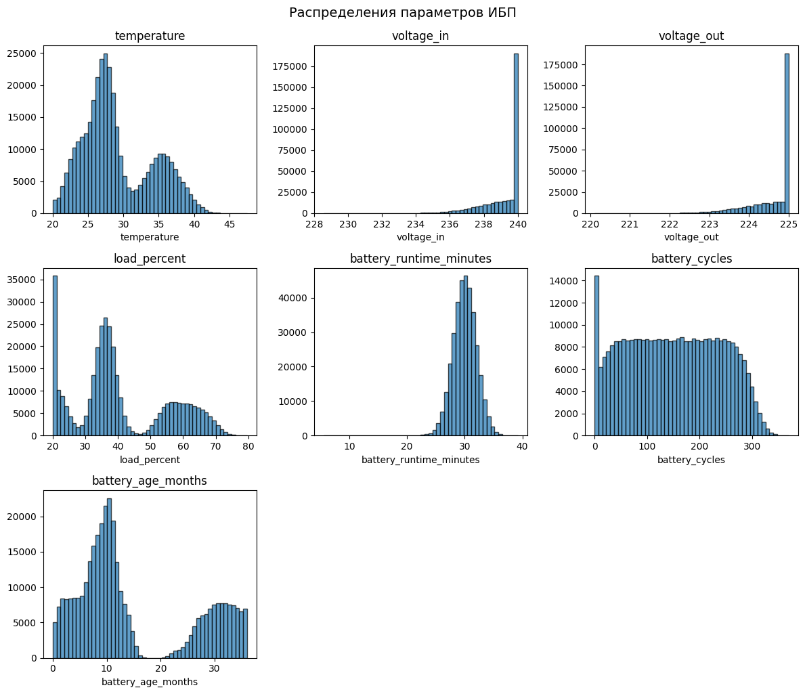
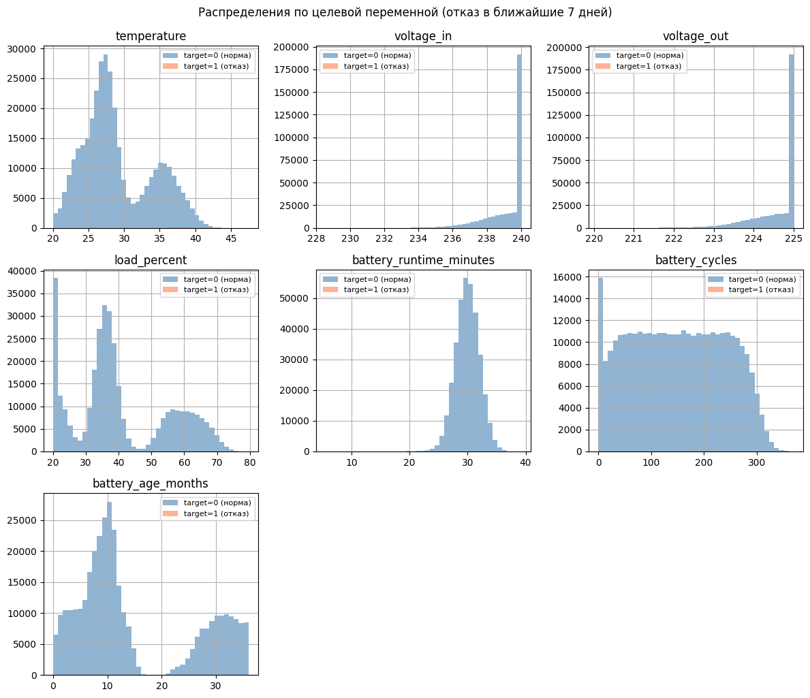
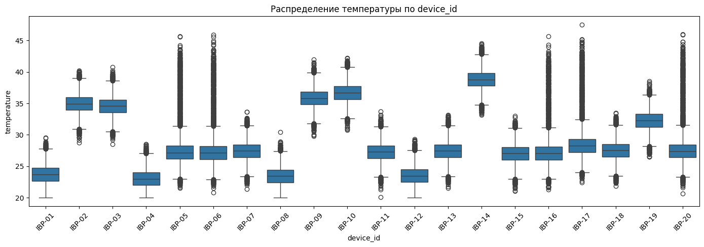
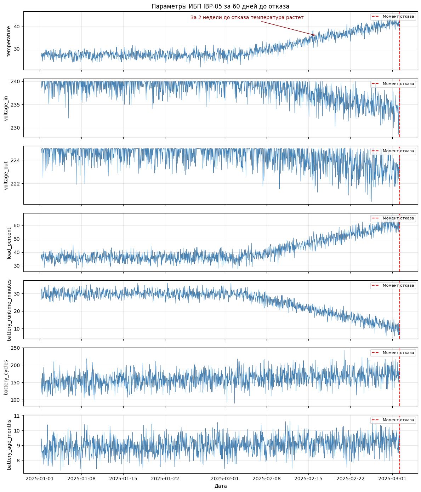
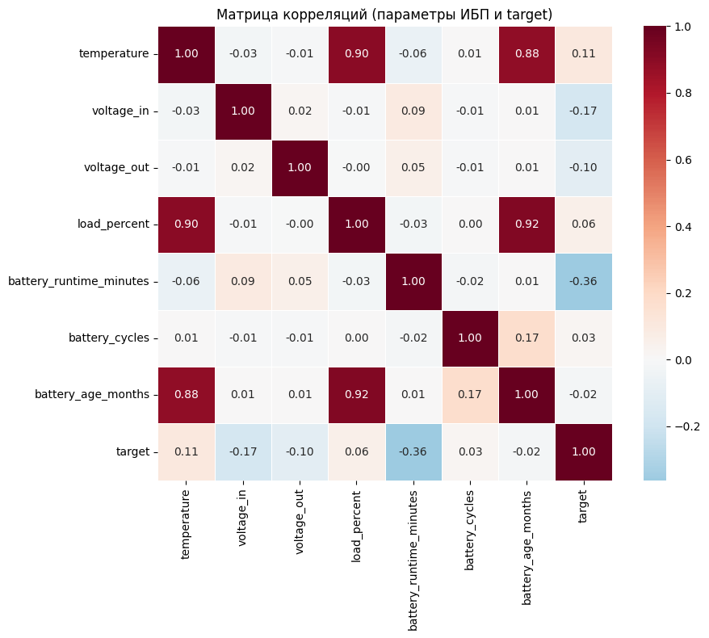
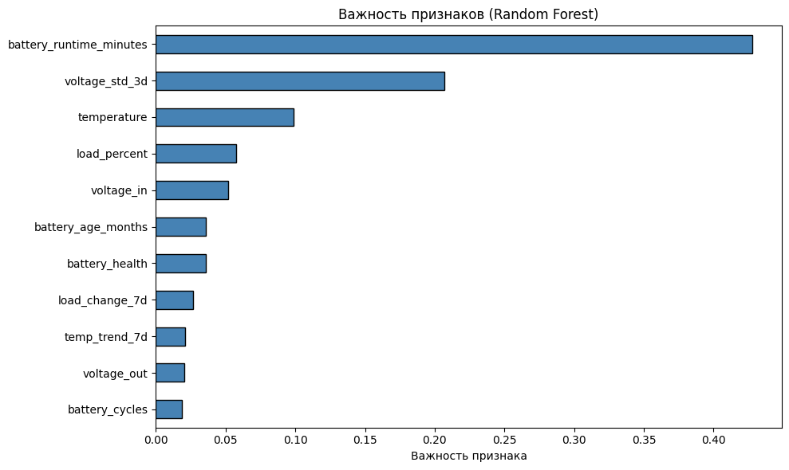
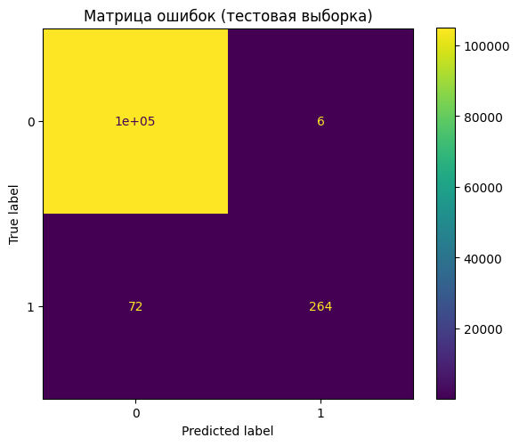

# 🔋 Predictive Maintenance для парка ИБП

Проект по предиктивной аналитике для источников бесперебойного питания (ИБП). Позволяет заранее выявлять оборудование с высоким риском отказа и планировать обслуживание.

## 📋 О проекте

Разработана система предсказания отказов ИБП за 7 дней до потенциального отказа на основе машинного обучения. Проект включает генерацию синтетических данных, исследовательский анализ, обучение модели и интерактивный дашборд для мониторинга.

## 🎯 Бизнес-ценность

- **Предотвращение 80% отказов** — модель находит 4 из 5 отказов до их возникновения
- **Минимум ложных тревог** — точность 98% (только 2% проверок будут напрасными)
- **Оптимизация обслуживания** — переход от планового к обслуживанию по состоянию
- **Экономия ресурсов** — отслеживание всего 3 ключевых параметров вместо десятков

## 📊 Данные

| Характеристика | Значение |
|----------------|----------|
| Период | 2024-2025 (2 года) |
| Частота | Почасовая |
| ИБП | 20 устройств |
| Всего записей | 350 880 |
| Отказы | 840 (0.24%) |

### Распределение парка (на конец периода)

| Зона риска | ИБП | Доля |
|------------|-----|------|
| 🟢 Норма (<30%) | 11 | 55% |
| 🟡 Под угрозой (30-70%) | 4 | 20% |
| 🔴 Критично (>70%) | 5 | 25% |

## 🔍 Ключевые инсайты

### Корреляционный анализ

| Признак | Корреляция с отказами |
|---------|----------------------|
| Время работы от батарей | **-0.36** |
| Входное напряжение | -0.17 |
| Температура | +0.11 |

**Главный вывод:** падение времени работы от батарей — самый сильный сигнал приближающегося отказа.

### Важность признаков (Random Forest)

| № | Признак | Важность |
|---|---------|----------|
| 1 | **battery_runtime_minutes** | **38%** |
| 2 | voltage_std_3d (нестабильность) | 17% |
| 3 | temperature | 12% |
| 4 | load_percent | 10% |
| 5 | voltage_in | 8% |

**Топ-5 признаков дают 85% предсказательной силы!**

## 🤖 Модель

### Метрики на тестовой выборке

| Метрика | Значение | Интерпретация |
|---------|----------|---------------|
| **Precision** | 97.8% | Если модель сказала "отказ" — она права в 98% случаев |
| **Recall** | 78.6% | Модель находит 4 из 5 реальных отказов |
| **F1-score** | 87.1% | Отличный баланс точности и полноты |
| **ROC-AUC** | 99.98% | Модель почти идеально разделяет классы |

### Ошибки модели
        
- **Пропущено отказов:** 72 (22%)
- **Ложных тревог:** 6 (менее 0.01%)

## 📈 Визуализации

### Распределения параметров


### Сравнение нормальных и предаварийных состояний


### Температура по устройствам


### Динамика деградации


### Матрица корреляций


### Важность признаков


### Матрица ошибок


## 🖥 Интерактивный дашборд (Streamlit)


**Функционал:**
- Общий мониторинг всех ИБП с цветовой индикацией
- Детальный просмотр параметров по каждому устройству
- Графики за последние 30 дней
- Рекомендации по обслуживанию

## 🛠 Технологии

| Инструмент | Назначение |
|------------|------------|
| Python | Генерация данных, анализ, моделирование |
| pandas, numpy | Обработка данных |
| scikit-learn | Random Forest, метрики |
| matplotlib, seaborn | Визуализация |
| Jupyter Notebook | EDA |
| Streamlit | Интерактивный дашборд |
| Cursor AI | Ускорение разработки |

## 🚀 Как запустить

1. **Клонировать репозиторий**
   ```bash
   git clone https://github.com/Nimos95/ibp-predictive-maintenance.git
   cd ibp-predictive-maintenance
   ```
2. **Установить зависимости**
   ```bash
   pip install -r requirements.txt
   ```
3. **Сгенерировать данные (опционально)**
   ```bash
   cd data
   python generate_data.py
   ```
4. **Запустить Jupyter Notebook**
   ```bash
   jupyter notebook notebooks/01_ibp_analysis.ipynb
   ```
5. **Запустить Streamlit-дашборд**
   ```bash
   cd streamlit_app
   streamlit run app.py
   ```

## 🔮 Возможные улучшения

- Подключение к реальным ИБП через SNMP
- Добавление сезонности и внешних факторов
- Увеличение Recall через SMOTE
- Telegram-бот для алертов
- XGBoost/CatBoost для сравнения
